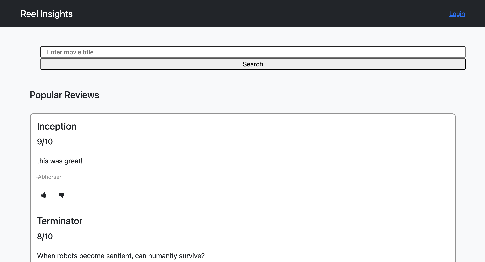
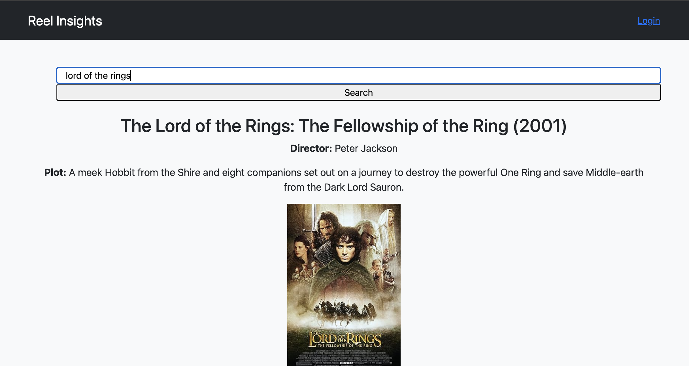

# Group Project Two: Reel Insights
A collaborative movie review project between Aiden Nelson, Noah Raffensparger, &amp; Ben Merchant.

## Description
This web app allows people to read reviews and sign up to join the site where they can search for movies and post reviews. More information on the site can be found in the [Usage](#usage) section below.

## Table of Contents

- [Libraries](#libraries)
- [Usage](#usage)
- [Deployed](#deployed)
- [Credits](#credits)
- [License](#license)

## Libraries

This project uses Bootstrap 5.x.x, jQuery, Express, Node.js, PostgresSQL, Sequalize, and Nodemailer. 

## Usage

### UX

A new visitor to the site can see the top reviews and sign up to the site. Once they've signed up to the site, they can search for movies and post a review themselves.

## Deployed

- [Click here to view the deployed webpage.](https://dashboard.render.com/)

## Credits

### API and Library

- [The Open Movie Database API](https://www.omdbapi.com/).

- [ExpressJS](https://expressjs.com/).

- [Nodemailer website.](https://nodemailer.com/) [Github repo for Nodemailer.](https://github.com/nodemailer/nodemailer/)

- [Handlebars website.](https://handlebarsjs.com/) [Github repo for Handlebars.](https://github.com/handlebars-lang/handlebars.js)

- [jQuery](https://jquery.com/).

- [Bootstrap website.](https://getbootstrap.com/) [Github repo for Bootstrap.](https://github.com/twbs)

- [PostgreSQL](https://www.postgresql.org/).

- [Sequelize website.](https://sequelize.org/) [Github repo for Sequelize.](https://github.com/sequelize/sequelize)

## License

MIT License (see repo)